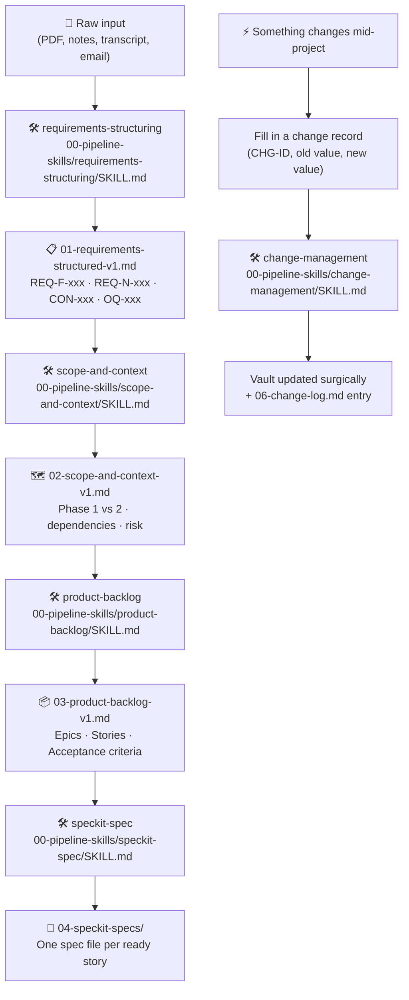

# How to Use This Vault

**This is your cheat sheet.** Open this file whenever you're not sure what to do next, where something lives, or how to handle a change.

---

## The pipeline at a glance



---

## Starting a new project

**Step 1 — Connect this folder in Cowork and attach your project brief**

Open Claude Cowork, select this folder, attach your PDF or paste your notes.

**Step 2 — Use this prompt:**

```
I have a project brief (attached). Read CLAUDE.md in this vault and run the full pipeline.
```

That's it. Claude reads CLAUDE.md, runs all 7 steps in order, and saves every file to this folder automatically.

**Step 3 — Review open questions before build starts**

After the pipeline runs, open `01-requirements-structured-v1.md` Section 5. Every OQ-xxx is a decision that needs a stakeholder answer. Phase 1 stories that depend on unresolved OQs will be marked "Not Ready — blocked on OQ-xxx" in the backlog.

**Step 4 — Hand specs to dev**

Stories marked Ready have spec files in `04-speckit-specs/`. Hand those to a developer using `/speckit.plan`, `/speckit.tasks`, and `/speckit.implement`.

---

## The ID system

| Prefix | What it is | Where it lives |
|--------|-----------|----------------|
| `REQ-F-xxx` | Functional requirement | `01-requirements-structured-v1.md` §2 |
| `REQ-N-xxx` | Non-functional requirement | `01-requirements-structured-v1.md` §3 |
| `CON-xxx` | Constraint | `01-requirements-structured-v1.md` §4 |
| `OQ-xxx` | Open question needing a stakeholder decision | `01-requirements-structured-v1.md` §5 |
| `AS-xxx` | Assumption | `01-requirements-structured-v1.md` §6 |
| `EPIC-x` | Epic | `03-product-backlog-v1.md` |
| `US-xxx` | User story | `03-product-backlog-v1.md` |
| `SPIKE-xxx` | Research spike | `03-product-backlog-v1.md` |
| `ENABLER-xxx` | Technical enabler | `03-product-backlog-v1.md` |
| `CHG-xxx` | Change record | `06-change-log.md` |

**Traceability chain:** `REQ-F-xxx` → `US-xxx` → spec file → (future: test case)

---

## Reading the vault

| File | Open it when you want to… |
|------|--------------------------|
| `00-project-home.md` | See project status, recent changes, Phase 1 blockers |
| `01-requirements-structured-v1.md` | Look up any REQ or OQ. Section 5 = all open questions. |
| `02-scope-and-context-v1.md` | Check what's Phase 1 vs Phase 2. Check build order. |
| `03-product-backlog-v1.md` | Read stories and AC. Check `Status:` to see if a story is ready. |
| `04-speckit-specs/` | Dev-ready specs. `00-index.md` lists all. `blocked-stories.md` explains what's not ready. |
| `05-traceability-matrix.md` | Trace any REQ → Story → Spec, or Story → Requirements. |
| `06-change-log.md` | Full history of every CHG-xxx, newest first. |
| `00-pipeline-skills/` | Skill instructions. Edit a SKILL.md here to improve a step. |

---

## Following a traceability chain

**Forward (requirement → where it ended up):**
Open `05-traceability-matrix.md` → find REQ-F-xxx row → read Phase, Epic, Story, Spec columns.

**Backward (story → why it exists):**
Open `05-traceability-matrix.md` → find US-xxx in the "Story → Requirements" table → read requirement IDs.

**What an open question blocks:**
Open `05-traceability-matrix.md` → "Open Questions" table at the bottom → read Blocks column.

---

## Handling a change mid-project

**Use this prompt:**

```
CHG-ID:        CHG-xxx          ← next number after the last entry in 06-change-log.md
Date:          YYYY-MM-DD
Triggered by:  [who / what meeting / what decision]
Change type:   [OQ resolved | Requirement modified | New requirement | Requirement removed]
Affected item: [REQ-F-xxx, OQ-xxx, US-xxx, etc.]
Old value:     [exact old text, or "none" for new items]
New value:     [exact new text, or "none" for removed items]
Reason:        [why this changed]
Resolves OQ:   [OQ-xxx, or — if none]
Notes:         [anything extra — e.g. "do not update OQ-013"]
```

Claude reads `00-pipeline-skills/change-management/SKILL.md` and makes only the necessary surgical edits. Every changed line gets tagged `[CHG-xxx]`. Old text is preserved with strikethrough. A full log entry is written to `06-change-log.md`.

**What Claude will NOT do automatically:**
- Create new user stories for a new requirement (it registers the REQ and flags story creation as a follow-up)
- Resolve other open questions unless you include them in the change record

---

## Quick-lookup: common tasks

| I want to… | Go to… |
|-----------|--------|
| Find a requirement by ID | `01-requirements-structured-v1.md` |
| Check which phase something is in | `02-scope-and-context-v1.md` or `05-traceability-matrix.md` |
| Check if a story is ready for dev | `03-product-backlog-v1.md` → find US-xxx → read `Status:` line |
| Find the spec for a story | `04-speckit-specs/00-index.md` or the `Spec:` line in the backlog |
| See why a story is blocked | `03-product-backlog-v1.md` → `Depends on:` and `Status:` lines |
| See what an OQ blocks | `05-traceability-matrix.md` → Open Questions table |
| See all changes made so far | `06-change-log.md` |
| Improve a skill | `00-pipeline-skills/[skill-name]/SKILL.md` → edit the rule that caused the wrong behaviour |
